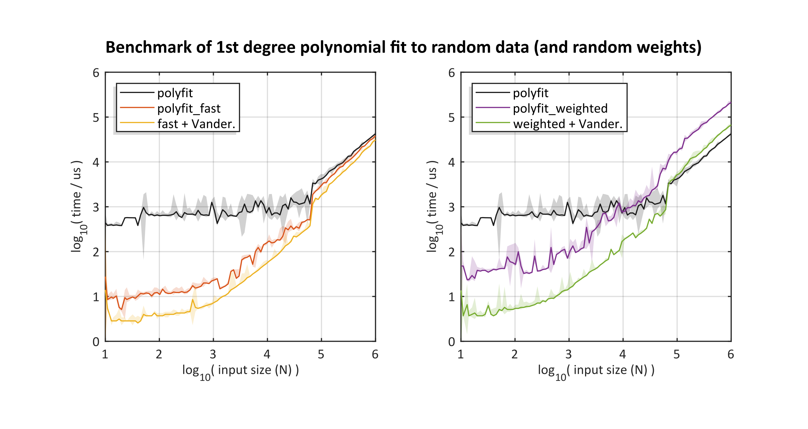
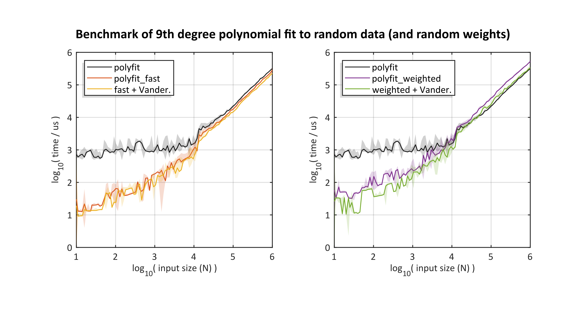

# poly-fast-matlab [](https://uk.mathworks.com/matlabcentral/fileexchange/80494-poly-fast-matlab) [](https://travis-ci.com/MarcinKonowalczyk/poly-fast-matlab)

Fast versions of Matlab's `polyval` and `polyfit` for sane people.

## Usage

Original `poly` functions are very good and useful, but they do a lot of not-always-necessary work (matrix condition checking), especially when one is in the middle of a tight `for`-loop. `poly_fast` functions do not do these checks, but assume the user is sane and knows what they're doing. It is recommended to **first** write one's code with normal `poly` functions, and then switch to the `poly_fast` once the code works fine. This can be done by simply replacing the calls to `polyfit` and `polyval` with ones to `polyfit_fast` and `polyval_fast`.

```matlab
x = linspace(-1,1,1e2); y = randn*x + randn(size(x));
P = polyfit_fast(x,y,1);
plot(x,y,'o',x,polyval_fast(P,x));
```

Note that the `poly_fast` functions do not implement the alternate scale-and-shift syntax - `[p,S,mu] = polyfit(x,y,n)`. You'll have to do that yourself.

## Reusing the Vandermode matrix

`polyfit` works by inverting the [Vandermode matrix](https://mathworld.wolfram.com/VandermondeMatrix.html) - matrix who's columns are successive powers of the x-axis. It it relatively fast, but unnecessary, to construct it each time. This becomes a bit of a bottleneck especially for dense x-axis or high-degree polynomials. To mitigate this, `poly_fast` functions both output, and take the Vandermode matrix as an input. This allows it to be re-used, but results in a more significant code rewrite. See `example.m` for detail.


## Weighted fit

Additionally a `polyfit_weighted` function can perform a weighted least-squares fit in a similar manner to `polyfit_fast`.

## Performance

For large input size (N), `polyfit_fast` scales approx. as $O(N^{1.1})$ (just like normal `polyfit`). For N less than approx. 1e4, `polyfit_fast` is about 2 orders of magnitude faster than `polyfit`.

<p align="center"></p>
<p align="center"></p>

## ToDo's

 - [ ] Test whether QR decomposition of the Vandermode matrix helps